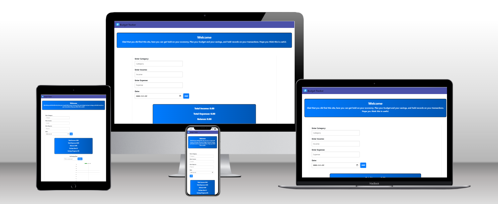
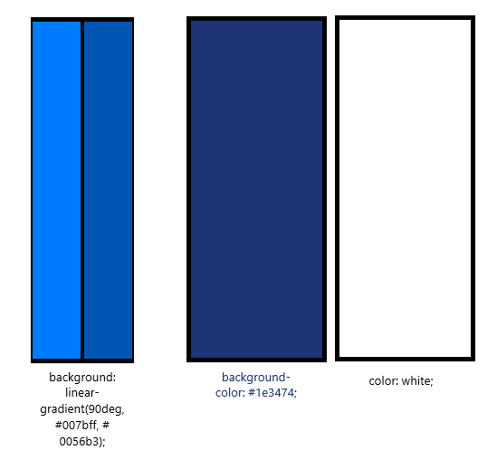
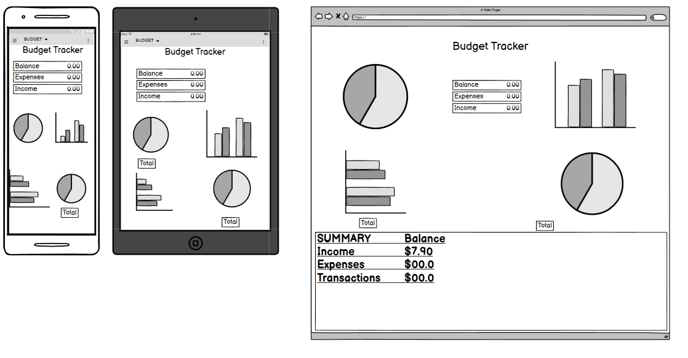

# Budget Tracker - Project Portfolio 2 - HTML, CSS and JavaScript. 

Budget Tracker is a website there you can go to if you want to get hold on your economy. There you can insert numbers and the site will calculate the numbers for you!

Visit the deployed site: [Budget Tracker](https://johan-4p.github.io/Budget-Tracker/)

# CONTENTS

* [User Experience](#user-experience-ux)
    * [User Stories](#user-stories)
* [Design](#design)
    * [Color Scheme](#color-scheme)
    * [Typography](#typography)
    * [Wireframe](#wireframe) 
    * [Features](#features)
        * [The Home Page](#the-home-page)
    * [Accessibility](#accessibity)
* [Technologies Used](#technologies-used)
    * [Languages Used](#languages-used)
    * [Frameworks, Libraries & Programs Used](#frameworks-libraries--programs-used)
* [Deployment & Local Development](#deployment--local-development) 
    * [Deployment](#deployment)
    * [Local Development](#local-development)
* [Testing](#testing)
    * [Solved Bugs](#solved-bugs)
* [Credits](#credits)
    * [Code Used](#code-used) 
    * [Content](#content)
    * [Media](#media)
    * [Acknowledgments](#acknowledgments)

---

## User Experience (UX)

### Target Audience
* Those who are looking for a page that can give them the information they want.

#### User Stories

* As a user, i want to input my income and expenses so i can track my financial situation.
* As a user, i want to set budget goals for different categories so that i can plan my spending.
* As a user, i want to see a summary of my financial data in charts so that i can easily understand my financial situation.

#### Site Aims
* I wish to create a site that the users wish to come back to.
#### Frequent Visitor Goals
* Easily see and integrate with numbers.
* That you can continue to follow your budget and savings goals and keep track on them.

---
## Design

### Color Scheme 
I have choose the color based on that fact that i want it to be an clean site

In my css file i have mostly used variables to declare color, and used these throughout the css file.
Its useful to use the same color code if you wish to alter the color on the webpage.
* For the most i have used a linear-gradient(90deg, #007bff, #0056b3); As a background-color
* for the navbar i used : #1e3474;
* And for the text i choose color: white;

### Typography
For this project i choose to use the font-family: 'Roboto', sans-serif;

### Wireframe 
Wireframes were created for mobile, tablet and laptops using balsamiq.

### Features 
The website build with one page
The website are responsive and have:
* A favicon in the browser tab.

 

 * I have the logo in the left upper corner and the name of the page.

 

#### The Budget Tracker
The site Budget tracker. Begins with a navbar that only contain the name of the page.
Then a header with a welcome text, after that a section with information about the page and how to get everything working and started, on the right side of the information you will see the form-section , there you can insert your amount and select if it is a income or expense and choose category and the date.
Next it comes a new section with the name of Summary. It shows the total income, expense, balance and saving goal and progress.

A part with a input that shows that you can set your savings goal.
The same for budget goals, the budget goals apers in the budget goals overview and will show how much you have set a as a roof and how much you have to the limit.

PieChart and a BarChart. The pie chart will show every expense in different color. 
The bar chart will show income and expense.

After that it comes a table with Detailed list of Income and Expenses, here you can see all transactions that been made and edit them or delete if you want.
Last on the page you have the Reset button and that do exactly that it resets the whole page .

### Accessibility

I have really tried to ensure that the website is as accessible as possible. I have achieve this by doing this:
* Using semantic HTML.
* Using a hover state on all buttons on the site to make it clear to the user if they are hovering over a button.
* Used the fonts because i think them are easily to read for people with dyslexia, and that include my self.

## Technologies Used

### Languages Used

HTML,CSS,JavaScript 

### Frameworks,Libraries & Program Used

* [Balsamiq](https://balsamiq.com/) - Used to create wireframes.

* [Git](https://git-scm.com/) - For version control.

* [Github](https://github.com/) - To save and store the files for the website.

* [GitPod](https://gitpod.io/) - IDE used to create the site.

* [Google Fonts](https://fonts.google.com/) - To import the fonts used on the website.

* [Google Developer Tools](https://developers.google.com/web/tools) - To troubleshoot and test features, solve issues with responsiveness and styling.
* [Favicon.io](https://favicon.io/) To create favicon.

* [W3C HTML Validator](https://validator.w3.org/) - To check HTML code.

* [W3C CSS Validator](https://jigsaw.w3.org/css-validator/) - To check CSS code.

* [JSHint JavaScript Validator](https://jshint.com/) - To check the JavaScript code.

* [Chart.js](https://www.chartjs.org/) - A JavaScript library.

* [Bootstrap](https://getbootstrap.com/) - A HTML & JavaScript library.

### Deployment

The site is deployed using GitHub Pages - [Budget Tracker](https://johan-4p.github.io/Budget-Tracker/)

To Deploy the site using GitHub Pages:

1. Login (or signup) to Github.
2. Go to the repository for this project, [Johan-4P/Budget-Tracker](https://github.com/Johan-4P/Budget-Tracker)
3. Click the settings button.
4. Select pages in the left hand navigation menu.
5. From the source dropdown select main branch and press save.
6. The site has now been deployed, please note that this process may take a few minutes before the site goes live.

### Local Development

#### How to Fork

To fork the repository:

1. Log in (or sign up) to Github.
2. Go to the repository for this project,[Johan-4P/Budget-Tracker](https://github.com/Johan-4P/Budget-Tracker)
3. Click the Fork button in the top right corner.

#### How to Clone

To clone the repository:

1. Log in (or sign up) to GitHub.
2. Go to the repository for this project, [Johan-4P/Budget-Tracker](https://github.com/Johan-4P/Budget-Tracker)
3. Click on the code button, select whether you would like to clone with HTTPS, SSH or GitHub CLI and copy the link shown.
4. Open the terminal in your code editor and change the current working directory to the location you want to use for the cloned directory.
5. Type 'git clone' into the terminal and then paste the link you copied in step 3. Press enter.
---
## Testing 
Please refer to [TESTING.md](TESTING.md) file for all testing carried out.

### Solved Bugs

| No | Bug | How I solved the issue |
| :--- | :--- | :--- |
| 1 | An error was displaying in the consol when next was clicked on the carousel | I have forgot to giv it correct filepath |
| 2 | Got 404 when trying to implement favicon | I have placed it in wrong folder |

---

## Credits 
https://www.w3schools.com/icons/default.asp
https://www.w3schools.com/howto/tryit.asp?filename=tryhow_js_popup
https://fonts.google.com/icons?selected=Material+Symbols+Outlined:info:FILL@0;wght@400;GRAD@0;opsz@24&icon.query=info&icon.size=24&icon.color=%23e8eaed
https://www.youtube.com/watch?v=TAB_v6yBXIE

### Code Used

* I Used much code from [Bootstrap](https://getbootstrap.com/)
* I have turned a lot to [ChatGPT](https://chatgpt.com/) - And got good answers.

### Content 

The information on the home page is written by me.
And the rest:

### Media

### Acknowledgments

I would like to acknowledge the following people:

* Jubril Akolade - My Code Institute Mentor.
*  The Code Institute Slack - The swedish channel was to big help.