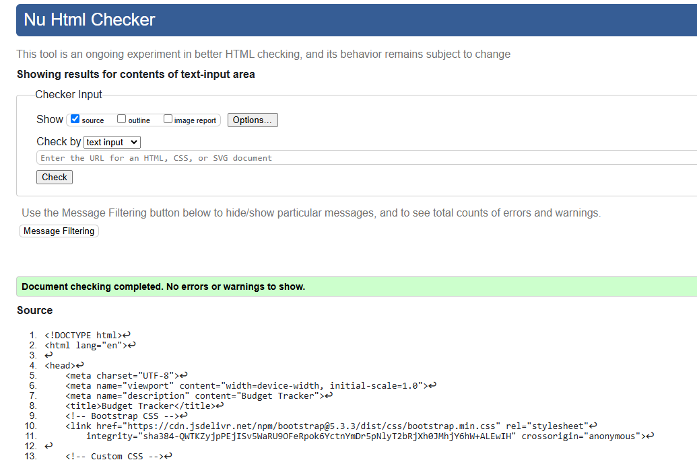
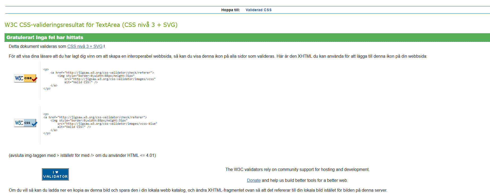
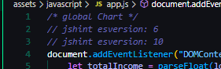
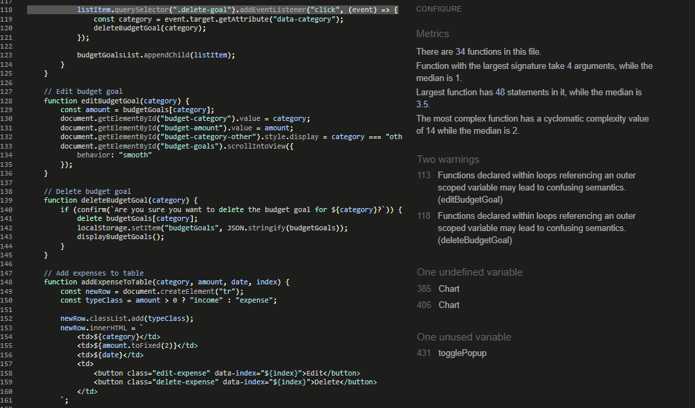
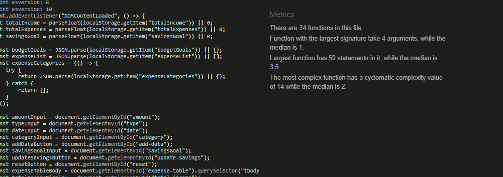
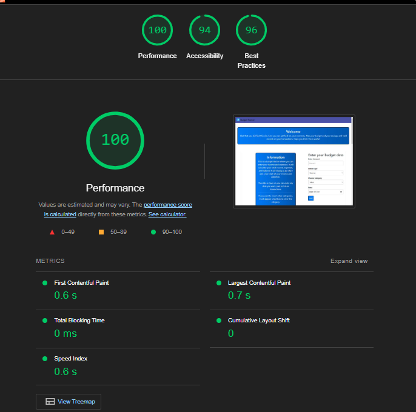
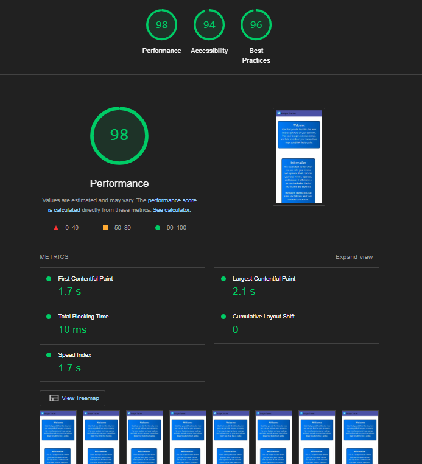

# Budget Tracker - Testing

Visit the deployed site [Mysterious Things](https://johan-4p.github.io/Mysterious-Things/index.html)
## CONTENTS

* [AUTOMATED TESTING](#automated-testing)
  * [W3C Validator](#w3c-validator)
  * [Lighthouse](#lighthouse)
* [MANUAL TESTING](#manual-testing)
  * [Testing User Stories](#testing-user-stories)
  * [Full Testing](#full-testing)

Testing was ongoing throughout the entire build. I utilized Chrome developer tools whilst building to pinpoint and troubleshoot any issues as I went along.

During development I made use of google developer tools to ensure everything was working correctly and to assist with troubleshooting when things were not working as expected.

I have gone through each page using google chrome developer tools to ensure that each page is responsive on a variety of different screen sizes and devices.

## AUTOMATED TESTING

### W3C Validator

[W3C](https://validator.w3.org/) was used to validate the HTML on all pages of the website. It was also used to validate the CSS.

*  Passed.

*  Passed.

---
### JSHint
* The first warning ive got was two warnings saying that i have wrong esversions. i Google it and got the same answer on multiple sites so this is what i done 

---
  Looked them up and did find a solution.
---
  Good results.
---

### Lighthouse

I used Lighthouse within the Chrome Developer Tools to test the performance, accessibility, best practices and SEO of the website.

### Desktop Results

*  Good results.
---
# Mobile Results

*  - Good results.
---

### Full Testing

Full Testing was performed on the following devices:

* Laptop:
    * Asus Tuf Gaming F15 15.6 inch screen.
* Mobile Devices:
    * Samsung galaxy 22 ultra.

I was using:

* Google Chrome.

Additional testing was taken by friends and family on a variety of devices and screen sizes. They reported no issues when using the website.

`Home Page`

| Feature | Expected Outcome | Testing Performed | Result | Pass/Fail |
| --- | --- | --- | --- | --- |
| Enter amount field | Cant leave empty | did leave it empty | An alert comes up with message: Please fill in all fields | Pass |
| Enter Choose Category field | Cant leave empty | did leave it empty | An alert comes up with message: Please fill in all fields | Pass |
| Date field | Cant leave empty | did leave it empty | An alert comes up with message: Please fill in all fields | Pass |
| Enter savings goal field | Cant leave empty | did leave it empty | An alert comes up with message: Please fill in all fields | Pass |
| Enter all fields in: Enter your budget data and press Add | All the fields gonna be empty | Button clicked | The page resets with empty fields and the Summary box have been updated | Pass |
| All Boxes have a information icon thats shows a popup when hoovered | A box with texts shows up | Icon hoovered | A box with text show up | Pass |
| Budget goals section: Select category, enter amount and click Save Goal | The item you have logged will appear in the table below | Add all and clicked | The item you have logged will appear in the table below | Pass |
| PieChart when hoovered the name on the item will appear | name on the item will appear | hoovered | The items name did appear | Pass |
| BarChart when hoovered the name on the item will appear | name on the item will appear | hoovered | The items name did appear | Pass |
| List of Income and Expenses: Abel to edit the item | Scrolled up to input fields and correct numbers appear | Clicked | Scrolled up to input fields and correct numbers appear | Pass |
| List of Income and Expenses: Abel to delete the item | Delete the item | Clicked | The item was deleted | Pass |
| Reset button | Will reset the whole page | Clicked | The page was reset | Pass |